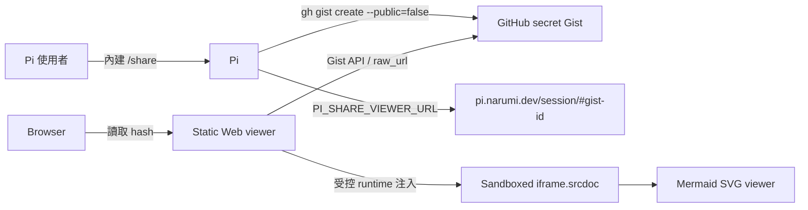

# pi-share-viewer 實作計畫

## Goal

交付可自行部署的靜態 Web viewer。使用者沿用 Pi 內建 `/share` 建立 GitHub secret Gist，並透過 `PI_SHARE_VIEWER_URL=https://pi.narumi.dev/session/` 將分享網址導向本專案；viewer 保留 Pi session 閱讀體驗，並將 Mermaid code block 顯示為可平移、縮放、全螢幕檢視的圖表。

## Context

- [x] 已確認 Pi `0.85.0` 的 `getShareViewerUrl()` 讀取 `PI_SHARE_VIEWER_URL`，並以 `${baseUrl}#${gistId}` 組合網址；因此設定值必須保留尾端 `/`。
- [x] 已確認 Pi 內建 `/share` 的 GitHub fallback 會匯出固定檔名 `session.html`，並以 `gh gist create --public=false` 建立 secret Gist。
- [x] 已確認若 Pi 有可用的 Radius provider 與憑證，`/share` 會優先回傳 Radius artifact URL；`PI_SHARE_VIEWER_URL` 只影響 GitHub Gist fallback。
- 原計畫的 custom extension 已不需要。目前 working tree 中未提交的 extension 程式與測試必須移除，不得納入最終 commit。
- 本機沒有可用的 Docker daemon，且依使用者決策，GitHub Actions 不執行 container job；本次以靜態設定測試與 production Web build 驗證 deployment artifacts，實際 image build 與 runtime 行為列為未驗證路徑。
- 專案只保留單一 Web app，因此不再使用 `web/` 子目錄；app、Vite 與 container 設定移至 repository root。
- Project、package 與 UI 名稱統一改為 `pi-share-viewer`；GitHub repository 已由使用者改名為 `narumiruna/pi-share-viewer`。
- [x] 已用真實 Pi `0.85.0` export fixture確認 rendered DOM會將 fenced Mermaid block輸出成`pre > code.hljs`，不保留`language-mermaid` class；enhancer需從`#session-data`的原始Markdown辨識 Mermaid source，再對應rendered code block。

## Architecture



系統邊界：

- 本 repository 只提供 Web viewer、測試與 container deployment artifact，不提供 Pi extension。
- GitHub 保存 session artifact；不建立 database、帳號系統或 server-side GitHub OAuth。
- Browser 直接讀取 GitHub Gist API；container 只提供編譯後靜態檔案。
- Web source、HTML entry、Vite config、`Dockerfile` 與 `nginx.conf` 均位於 repository root，避免單一 app 仍有多餘巢狀目錄。
- TLS 與 `pi.narumi.dev` DNS 由外部 reverse proxy 或 deployment platform 管理。

目標結構：

```text
.
├── src/
├── session/
├── tests/
├── index.html
├── Dockerfile
├── nginx.conf
├── compose.yaml
├── vite.config.ts
└── vite.enhancer.config.ts
```

## Tech Stack

- Web：TypeScript、Vite、Mermaid、原生 DOM API。
- Test：Vitest、JSDOM、Playwright Chromium。
- Runtime image：multi-stage pinned Node builder 與 pinned Nginx unprivileged image。
- Deployment：repository root `compose.yaml`，預設 `${PORT:-8080}:80`。

## Non-Goals

- 不實作 Pi extension、自訂 slash command、session exporter 或 Gist uploader。
- 不改寫 Pi 內建 `/share`，也不處理 Radius artifact。
- 不提供 Gist 權限管理、刪除、列表、server-side proxy 或 GitHub OAuth。
- 不提供 Mermaid 編輯器、PNG/WebM export、協作功能或 server-side Open Graph preview。

## Risks

- **敏感資料外洩：** secret Gist 只是 unlisted link，並非具存取控制的 private storage。README 必須說明分享與刪除方式。
- **不可信 HTML：** Gist HTML 視為不可信內容，僅放入不含 `allow-same-origin`、form、popup 或 top navigation 權限的 sandboxed iframe。
- **資源耗盡：** 限制 Gist response、單張 Mermaid source、圖表數量及 render 時間。
- **GitHub rate limit：** Browser 匿名存取 Gist API可能受到 per-IP rate limit；viewer 應顯示清楚錯誤。
- **Browser 差異：** Chromium 是自動化最低保證；Firefox/WebKit 狀態需明確記錄。
- **Container runtime 未驗證：** 執行環境沒有 Docker daemon，CI 也依使用者決策不執行 container job；Dockerfile、Nginx與Compose僅由靜態測試覆蓋，部署前仍需在具Docker的環境實際驗證。

## Plan

### 1. 收斂成純 Web repository

- [x] 移除 `src/extension/`、extension 單元測試、舊 placeholder source，以及 `package.json` 的 `pi.extensions` manifest與 Pi peer dependency；以 `git diff --name-status` 證明最終沒有 extension artifact。
- [x] 將 package、README、UI、Docker service、Git remote與branch名稱統一為`pi-share-viewer`及`narumiruna/pi-share-viewer`，但保留既有public viewer domain `pi.narumi.dev`；以`rg`、`git remote -v`與`git branch --show-current`驗證。
- [x] 將 `web/` 內的 app source、HTML entry、Vite config、`Dockerfile` 與`nginx.conf`移至repository root，修正所有path且刪除空的`web/`；以`find`與production build驗證目標扁平結構。
- [x] 將 package scripts、TypeScript、Biome、Vitest 與 lockfile 收斂到 Web app、unit tests及 E2E；以 `npm ci`、`npm run check` 與 `npm test` 驗證乾淨安裝及設定。
- [x] 確認 production source file 均低於 1,000 行，且 generated Mermaid bundle、Playwright output與暫存 export fixture不會進入 Git。

### 2. 完成 Gist session loader

- [x] 提供 `/` 說明頁與 `/session/` viewer shell，production build 在 root `dist/` 產生可直接由 static server 提供的檔案；以 `npm run build` 驗證。
- [x] Hash parser 僅接受 `#<32-hex-gist-id>`；以 Vitest 覆蓋空值、錯誤長度、非 hex、額外 path/query與大小寫正規化。
- [x] Gist client 固定要求 `session.html`，驗證 API response shape、content type、size與 HTTPS `raw_url` allowlist；以 mocked fetch 覆蓋 inline、truncated raw、404、403 rate limit、缺檔、錯誤 host、redirect、abort及超限內容。
- [x] Loading、error與loaded state不得以 `innerHTML` 插入遠端錯誤；以 JSDOM及Playwright證明惡意 response只顯示為文字。

### 3. 完成 sandboxed Mermaid viewer

- [x] 將固定版本 Mermaid bundle納入 build，不依賴 runtime CDN；以 production artifact檢查確認 enhancer可離線載入。
- [x] 將 Pi `session.html` 與 enhancer放入 `iframe.srcdoc`；parent與child使用分離 CSP，sandbox只允許必要 script、download與fullscreen，且不含 `allow-same-origin`；以 Chromium E2E驗證正常載入而非 `ERR_BLOCKED_BY_CSP`。
- [x] Enhancement runtime從`#session-data`擷取原始 fenced Mermaid sources並對應`pre > code.hljs`，再以idempotent marker及`MutationObserver`避免重複render；以有效、無效、一般code block與動態新增fixture驗證。
- [x] 每張有效圖提供 pan、zoom in/out、fit、reset、fullscreen、source/diagram切換及copy source；以Playwright操作 controls並確認原始session data未改變。
- [x] 單張render失敗或超限時保留source並顯示局部錯誤，不中斷其他圖表；以有效、無效、過長及超過數量限制的fixtures驗證。
- [x] Mermaid theme依Pi export背景亮度選擇light/dark；在390×844、1440×900與1920×1080檢查圖表可操作、文字有對比且parent page沒有水平overflow。
- [x] 修正hash快速切換的request lifecycle，使舊request會abort且不能覆蓋新內容；以Vitest或Playwright regression test驗證。

### 4. 完成 Docker與Compose部署

- [x] Root `Dockerfile` 使用 pinned multi-stage Node builder及 pinned Nginx unprivileged runtime，最終 process 以 non-root user 執行；以設定測試與人工review驗證，實際`docker build`列為未驗證路徑。
- [x] Root `nginx.conf` 設定 `/`、`/session/`、hashed assets 與 `/healthz`，HTML no-cache、hashed assets immutable，並提供安全 headers；以設定測試驗證規則，實際container HTTP response列為未驗證路徑。
- [x] `.dockerignore`排除`.git`、`node_modules`、coverage、test artifact、generated output與本機設定；review build context設定。
- [x] `compose.yaml`提供`${PORT:-8080}:80`、`restart: unless-stopped`、healthcheck、read-only root filesystem、必要tmpfs及security options；以YAML parse、設定測試與人工review驗證，實際Compose lifecycle列為未驗證路徑。

### 5. 文件、整合驗證與交付

- [x] README說明`PI_SHARE_VIEWER_URL=https://pi.narumi.dev/session/`設定方式、尾端斜線、Radius優先行為、`gh auth login`、內建`/share`、本機開發、Docker Compose、`PORT`、reverse proxy、secret Gist威脅模型、rate limit、刪除方式及browser support；人工比對實際行為。
- [x] E2E使用真實Pi export fixture與mocked GitHub route，完整驗證hash → Gist fetch → sandboxed iframe → Mermaid SVG → controls；以`npm run test:e2e`通過。
- [ ] `npm run ci` 執行 format/lint、unit tests、typecheck、root Web build 及靜態設定驗證；本機成功後由 GitHub Actions 的單一`test` job再次驗證，不建立或啟動container。
- [x] Review完整diff，檢查安全性、lifecycle、相容性、unrelated changes與不必要依賴；修正問題並重跑受影響檢查。
- [ ] 更新本計畫的每個checkbox與驗證證據；全部通過後刪除`PLAN.md`。
- [ ] 僅stage預期檔案，建立signed Conventional Commit，push `narumi/feat/pi-share-viewer`，並開啟含摘要、驗證證據及風險的pull request。

## Completion Checklist

- [x] Repository沒有Pi extension manifest、source或tests；project identity為`pi-share-viewer`，且`PI_SHARE_VIEWER_URL`文件與Pi `0.85.0`實際行為一致。
- [x] `npm ci`、`npm run check`、`npm test`、`npm run build`、`npm run test:e2e` 與 `npm run ci` 全部通過。
- [x] Repository root 符合目標扁平結構，沒有殘留 `web/` 目錄或指向它的設定。
- [ ] GitHub Actions僅保留Web app的`test` job且驗證通過；Docker image build、container routes與runtime hardening明確記錄為未驗證路徑。
- [x] 有效、無效、超限、light及dark fixtures通過；390×844、1440×900與1920×1080沒有parent水平overflow。
- [x] iframe沒有`allow-same-origin`，遠端錯誤不進入parent `innerHTML`，CSP與URL allowlist測試通過。
- [x] README提供Pi內建`/share`與`https://pi.narumi.dev/session/#<gist-id>`操作方式，repository root提供Docker Compose deployment artifact；container runtime維持明確未驗證。
- [ ] 所有計畫項目有驗證證據，`PLAN.md`已刪除，signed commits已push且pull request已建立。

## Verification Evidence

- `npm ci`：乾淨安裝328個packages，audit為0個vulnerabilities。
- `npm run ci`：Biome、39個Vitest cases、TypeScript及兩段production build通過。
- `npm run test:e2e`：6個Chrome cases通過，包含真實Pi export、Mermaid controls、CSP、race、錯誤與三種viewport。
- `docker compose config --quiet`及PyYAML parse通過；依使用者決策未執行image build或container runtime測試。
- `gh api gists/2b736fe885c106e7ee125d52b1cfecbb`確認sample為secret Gist，含未截斷的`text/html` `session.html`。
- `git diff --check`通過；production source合計少於1,000行，`web/`不存在，generated與test artifacts均被ignore。
