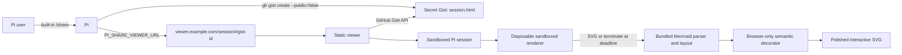

# pi-share-viewer

`pi-share-viewer` is a self-hosted viewer for Pi session Gists. It preserves Pi's exported tree navigation, message deep links, and JSONL downloads, applies a responsive Radix-based reading interface, and converts Mermaid fences into accessible interactive diagrams with natural sizing, pan, zoom, focused tracing, fullscreen, source, export, and deep-link controls.

User and assistant messages also support browser-local KaTeX math, with bundled styles and fonts.

No Pi extension is required. Pi's built-in `/share` already creates `session.html`; `PI_SHARE_VIEWER_URL` changes the URL returned for its GitHub Gist fallback.

> GitHub secret Gists are unlisted, not private. Anyone with the URL can read the complete session.

## How it works



Pi `0.85.0` is the verified baseline. Its exported DOM does not retain a `language-mermaid` class, so the viewer reads every fenced-code occurrence from `#session-data` and correlates it with rendered blocks by entry and source order. This preserves fence identity when ordinary and Mermaid blocks contain the same text, including fences nested in Markdown block quotes and lists.

### Browser-only diagram polish

Diagram conversion runs entirely in the browser. Each Mermaid render uses a disposable nested sandbox iframe that is removed at the five-second deadline. A visible-first queue runs at most two sandboxes concurrently and leaves offscreen source intact until it approaches the viewport. Mermaid remains the syntax and layout engine; a local semantic decorator adds an Archify-inspired signal-flow surface, explicit semantic node colors, high-contrast edges, diagram-type labels, focused relationships, and opt-in trace motion. No diagram source is sent to a rendering API.

The progressive decorator is verified for `flowchart`, `sequenceDiagram`, and `stateDiagram-v2`. Those diagrams default to Polished mode while preserving Mermaid-authored `classDef`, `style`, `accTitle`, and `accDescr` output; Original mode restores the bundled Mermaid presentation. Other Mermaid diagram types render in Original mode with generic viewer controls and no unsupported semantic decoration.

### Diagram controls

Inline diagrams keep their natural rendered size and only shrink when necessary. Fit recalculates after container resize and fullscreen changes. Available controls include:

- Mouse drag or the arrow keys to pan; `+`/`-` to zoom and `0` to fit.
- `Ctrl`/`Cmd` + wheel or a two-pointer pinch to zoom around the gesture position. An ordinary wheel or one-finger swipe continues scrolling the session.
- Original/Polished presentation, optional reduced-motion-aware edge tracing, source display, and fullscreen. Flowchart nodes can be focused to isolate directly related paths; other diagram kinds retain generic tracing when reliable endpoint metadata is unavailable.
- Copy source, Copy SVG, Download SVG, Download PNG, and Copy diagram link. All exports are generated locally from the accepted SVG and make no rendering-service request.

The desktop toolbar groups controls from left to right: zoom/fit/reset, presentation/tracing, source, sharing/export, then fullscreen. On narrow screens, zoom, fit, fullscreen, and **More diagram actions** remain visible; More contains reset, presentation/tracing, source, and sharing/export in that order. Opening More focuses its first action; arrow keys navigate the toolbar, and Escape closes More and returns focus to its button. The expanded actions remain in the card's layout and wrap within nested Markdown containers instead of covering or clipping the diagram. Malformed or oversized diagrams retain their source and show a concise error with expandable technical details.

### Radix session interface

The enhancer preserves Pi's DOM structure and interactions, then adds a scoped responsive chrome layer using Radix Colors. Mermaid controls run as an isolated React island built with Radix Toolbar, Toggle, Tooltip, and Icons primitives. The restyled sidebar, session metadata, messages, tools, Markdown, tables, and code blocks do not require a second session renderer or any external assets.

### LaTeX math

The verified Pi `0.85.0` export supports these delimiters in user and assistant Markdown:

```text
Inline: $x_i$ or \(x_{i_j}\)
Display: $$\frac{a}{b}$$ or \[\sum_{i=1}^{n} i\]

$$
\begin{aligned}
a &= b \\
c &= d
\end{aligned}
$$
```

Formulas work in paragraphs, lists, block quotes, and table cells. Use `\lvert` / `\rvert` or Markdown-escaped pipes in tables so the table parser does not split a formula into cells. Long inline and display formulas scroll horizontally on narrow screens. Inline delimiters cannot span lines. This is KaTeX's supported TeX subset, not a complete LaTeX document engine; arbitrary packages, TikZ, automatic numbering, and cross-references are not provided.

A single-dollar formula cannot begin or end with whitespace, and its closing dollar cannot be followed by a digit. `$5 and $10` stays ordinary text, but `$5$` is a formula. Write `\$5` for a literal price, or use inline code to show formula syntax. Inline code, fenced code (including `latex` / `tex` fences), raw HTML, link destinations, tool output, thinking, summaries, custom messages, and Mermaid labels are not math-enhanced.

The viewer protects formulas before Pi's Markdown parser consumes their punctuation. A compatibility-checked hook changes only four user/assistant parsing call sites and runs the enhancer after Pi's vendored libraries but before its application script. It retains Pi's URL sanitization, code highlighting, original `#session-data`, message links, tree navigation, and JSONL download. If the expected template structure or parser extensions differ, math enhancement falls back to the original Pi Markdown presentation without partially patching the template; Pi may consume backslash delimiters in that fallback.

KaTeX, scoped CSS, WOFF2 fonts, and the KaTeX license are bundled into the enhancer; no CDN or formula-rendering service is used. Parent and child CSP allow only `data:` fonts. Rendering uses `trust: false`, strict errors, isolated macros, `maxExpand: 1000`, and `maxSize: 20`. Commands requiring trust cannot create links, load images, or inject HTML; KaTeX may display their command names in red.

Invalid or oversized formulas keep their delimited source. Limits per session document are 10,000 UTF-8 bytes per formula, 500 attempted renders, and 500,000 cumulative source bytes (including delimiters). Oversized formulas do not consume the render budget. At most ten formulas are processed per batch before yielding; repeated scans of the same DOM do not consume the budget again, while newly created formula nodes do. A page reload resets the budget. These bounds are not a forcibly interruptible timeout for synchronous KaTeX rendering or Pi's existing Markdown parsing.

## Configure Pi

Requirements for sharing:

- Pi with the built-in `/share` command; verified with `0.85.0`
- [GitHub CLI](https://cli.github.com/) authenticated with Gist access
- This viewer deployed over HTTPS

Authenticate GitHub CLI if needed:

```bash
gh auth login
```

Set the viewer URL **before starting Pi**, replacing the example host with your deployment origin. The trailing `/` is required because Pi appends `#<gist-id>` directly:

```bash
export PI_SHARE_VIEWER_URL="https://viewer.example.com/session/"
pi
```

Run the built-in command in Pi:

```text
/share
```

When `/share` uses its GitHub fallback, Pi returns:

```text
https://viewer.example.com/session/#<32-character-gist-id>
```

### Radius behavior

If Pi has an available Radius provider and valid Radius credentials, `/share` uploads there first and returns the Radius artifact URL. `PI_SHARE_VIEWER_URL` only changes the GitHub Gist fallback URL; it does not override Radius or force a Gist upload.

To remove the custom viewer setting, unset the variable before starting Pi:

```bash
unset PI_SHARE_VIEWER_URL
```

## Security and privacy

A shared session can contain:

- Prompts and assistant responses
- Source code and tool output
- Local file paths
- Embedded images
- Credentials or other secrets printed during the session

Review the session before sharing. Delete a Gist when it is no longer needed:

```bash
gh gist delete <gist-id>
```

The viewer treats every Gist as untrusted:

- Only a 32-character hexadecimal Gist ID, optional eight-character hexadecimal Pi `leafId`/`targetId` values, a validated `<entry-id>-diagram-<1..50>` diagram target, and the fixed `session.html` filename are accepted.
- Raw content must use HTTPS on the exact `gist.githubusercontent.com` host and match the requested Gist and filename.
- API metadata, session HTML, Mermaid source count, source bytes, rendered SVG bytes, and render time have explicit limits.
- Remote errors are written with `textContent`, never inserted into the parent page as HTML.
- The session runs in an iframe with `allow-scripts` and `allow-downloads` so Pi's user-initiated JSONL export works, but without `allow-same-origin`, forms, popups, or top navigation.
- Separate parent and child Content Security Policies prevent the session from making network requests or loading external images. Local `data:`/`blob:` images are allowed for SVG-to-PNG export. The parent permits inline script and style only because `srcdoc` inherits its policy; remote values never enter the parent as HTML.
- Mermaid runs in a disposable nested sandbox that is terminated at the render deadline; the local runtime makes no rendering-service requests and uses `securityLevel: "strict"`.
- A broken or oversized diagram keeps its source visible and does not stop the rest of the session.

The parent page calls GitHub's unauthenticated Gist API directly. GitHub can rate-limit requests by IP; the viewer reports 403 and 429 responses without embedding a GitHub token. A server-side proxy or OAuth flow is intentionally out of scope.

## Local development

Requirements:

- Node.js 22.22.2 or newer
- Google Chrome for the Playwright suite

Install and start Vite:

```bash
npm ci
npm run dev
```

Open `http://localhost:5173/`. A local session URL has this form:

```text
http://localhost:5173/session/#<gist-id>
```

Pi's message copy buttons add validated branch and message identifiers:

```text
http://localhost:5173/session/#<gist-id>&leafId=<entry-id>&targetId=<entry-id>
```

Each rendered Mermaid card can copy a stable diagram link. The diagram target remains separate from Pi's branch parameters:

```text
http://localhost:5173/session/#<gist-id>&leafId=<entry-id>&targetId=<entry-id>&diagramId=<entry-id>-diagram-<number>
```

The local HTTP exception is restricted to loopback hosts. Production viewer origins must use HTTPS.

## Deploy with GitHub Pages

The included `.github/workflows/deploy-pages.yml` workflow publishes `dist/` after every push to `main`. It uses the base path reported by GitHub Pages, so repository URLs and custom domains work without source changes.

1. Push the repository to GitHub.
2. In **Settings → Pages → Build and deployment**, select **GitHub Actions** as the source.
3. Run **Deploy GitHub Pages** from the Actions tab, or push to `main`.
4. Set Pi's viewer URL to the deployed session path, including the trailing slash:

   ```bash
   export PI_SHARE_VIEWER_URL="https://<owner>.github.io/<repository>/session/"
   pi
   ```

For a custom subdomain, add a DNS-only `CNAME` record pointing it to `<owner>.github.io`, configure the same domain under **Settings → Pages**, and use the root session path:

```bash
export PI_SHARE_VIEWER_URL="https://viewer.example.com/session/"
pi
```

Keep the Cloudflare proxy disabled until GitHub's DNS check and HTTPS certificate provisioning complete. GitHub Pages only hosts the static viewer; browser requests to the unauthenticated GitHub Gist API remain subject to GitHub's rate limits.

## Verification

```bash
npm ci
npm run check
npm test
npm run typecheck
npm run build
npm run test:e2e
npm run ci
```

`npm run test:e2e` creates a real Pi HTML export from `tests/fixtures/session.jsonl`, then intercepts GitHub requests. Automated tests do not create, read, or delete real Gists.

The CI workflow runs `npm run ci`: formatting and lint checks, unit tests, TypeScript checks, and the production build. Playwright E2E tests run separately with `npm run test:e2e`. The Pages workflow builds and publishes the static site.

Browser support:

- Google Chrome/Chromium: covered by automated E2E tests
- Firefox and WebKit/Safari: not currently verified; basic session and source fallback are expected but not claimed as supported

## Project layout

```text
src/                       Gist loader, Radix session UI, math hook/parser/renderer, Mermaid runtime, view controls, render queue, decorator, and export helpers
session/                   Session viewer HTML entry
index.html                 Landing page
.github/workflows/         CI and GitHub Pages deployment
vite.config.ts             Static application build
vite.enhancer.config.ts    Bundled session enhancer build
vite.renderer.config.ts    Isolated Mermaid renderer build
tests/                     Unit and browser integration tests
```

Generated files such as `dist/`, `public/assets/mermaid-enhancer.js`, `public/assets/mermaid-renderer.js`, Playwright reports, screenshots, and temporary Pi exports are ignored by Git.

## Limits and non-goals

The viewer accepts session HTML up to 12 MiB, at most 50 Mermaid diagrams, and up to 100,000 UTF-8 bytes per Mermaid source. Each diagram has a five-second render deadline.

The project does not provide a Pi extension, GitHub OAuth, server-side storage, Gist management, Mermaid editing, video export, collaboration, or server-rendered social previews. SVG and PNG diagram export are browser-local only.
