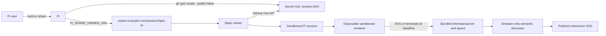

# pi-share-viewer

`pi-share-viewer` is a self-hosted viewer for Pi session Gists. It preserves Pi's exported tree navigation, message deep links, and JSONL downloads, applies a responsive Radix-based reading interface, and converts Mermaid fences into polished interactive diagrams with pan, zoom, fit, optional edge tracing, fullscreen, source, and copy controls.

No Pi extension is required. Pi's built-in `/share` already creates `session.html`; `PI_SHARE_VIEWER_URL` changes the URL returned for its GitHub Gist fallback.

> GitHub secret Gists are unlisted, not private. Anyone with the URL can read the complete session.

## How it works



Pi `0.85.0` is the verified baseline. Its exported DOM does not retain a `language-mermaid` class, so the viewer reads every fenced-code occurrence from `#session-data` and correlates it with rendered blocks by entry and source order. This preserves fence identity when ordinary and Mermaid blocks contain the same text, including fences nested in Markdown block quotes and lists.

### Browser-only diagram polish

Diagram conversion runs entirely in the browser. Each Mermaid render uses a disposable nested sandbox iframe that is removed at the five-second deadline, terminating that renderer before the queue continues. Mermaid remains the syntax and layout engine; a local semantic decorator adds an Archify-inspired signal-flow surface, stable node colors, high-contrast edges, diagram-type labels, and opt-in trace motion. No diagram source is sent to a rendering API, and unsupported SVG details fall back to Mermaid's normal output instead of failing the session.

The progressive decorator is verified for `flowchart`, `sequenceDiagram`, and `stateDiagram-v2`. Other Mermaid diagram types still render with the bundled Mermaid theme and existing viewer controls.

### Radix session interface

The enhancer keeps Pi's original DOM and interaction scripts, then adds a scoped responsive chrome layer using Radix Colors. Mermaid controls run as an isolated React island built with Radix Toolbar, Toggle, Tooltip, and Icons primitives. The restyled sidebar, session metadata, messages, tools, Markdown, tables, and code blocks do not require a second session renderer or any external assets.

## Configure Pi

Requirements for sharing:

- Pi with the built-in `/share` command; verified with `0.85.0`
- [GitHub CLI](https://cli.github.com/) authenticated with Gist access
- This viewer deployed over HTTPS

Authenticate GitHub CLI if needed:

```bash
gh auth login
```

Set the viewer URL **before starting Pi**, replacing the example host with your deployment origin. The trailing `/` is required because Pi appends `#<gist-id>` directly:

```bash
export PI_SHARE_VIEWER_URL="https://viewer.example.com/session/"
pi
```

Run the built-in command in Pi:

```text
/share
```

When `/share` uses its GitHub fallback, Pi returns:

```text
https://viewer.example.com/session/#<32-character-gist-id>
```

### Radius behavior

If Pi has an available Radius provider and valid Radius credentials, `/share` uploads there first and returns the Radius artifact URL. `PI_SHARE_VIEWER_URL` only changes the GitHub Gist fallback URL; it does not override Radius or force a Gist upload.

To remove the custom viewer setting, unset the variable before starting Pi:

```bash
unset PI_SHARE_VIEWER_URL
```

## Security and privacy

A shared session can contain:

- Prompts and assistant responses
- Source code and tool output
- Local file paths
- Embedded images
- Credentials or other secrets printed during the session

Review the session before sharing. Delete a Gist when it is no longer needed:

```bash
gh gist delete <gist-id>
```

The viewer treats every Gist as untrusted:

- Only a 32-character hexadecimal Gist ID, optional eight-character hexadecimal Pi `leafId`/`targetId` values, and the fixed `session.html` filename are accepted.
- Raw content must use HTTPS on the exact `gist.githubusercontent.com` host and match the requested Gist and filename.
- API metadata, session HTML, Mermaid source count, source bytes, rendered SVG bytes, and render time have explicit limits.
- Remote errors are written with `textContent`, never inserted into the parent page as HTML.
- The session runs in an iframe with `allow-scripts` and `allow-downloads` so Pi's user-initiated JSONL export works, but without `allow-same-origin`, forms, popups, or top navigation.
- Separate parent and child Content Security Policies prevent the session from making network requests or loading external images. The parent permits inline script and style only because `srcdoc` inherits its policy; remote values never enter the parent as HTML.
- Mermaid runs in a disposable nested sandbox that is terminated at the render deadline; the local runtime makes no rendering-service requests and uses `securityLevel: "strict"`.
- A broken or oversized diagram keeps its source visible and does not stop the rest of the session.

The parent page calls GitHub's unauthenticated Gist API directly. GitHub can rate-limit requests by IP; the viewer reports 403 and 429 responses without embedding a GitHub token. A server-side proxy or OAuth flow is intentionally out of scope.

## Local development

Requirements:

- Node.js 22.22.2 or newer
- Google Chrome for the Playwright suite

Install and start Vite:

```bash
npm ci
npm run dev
```

Open `http://localhost:5173/`. A local session URL has this form:

```text
http://localhost:5173/session/#<gist-id>
```

Pi's message copy buttons add validated branch and message identifiers:

```text
http://localhost:5173/session/#<gist-id>&leafId=<entry-id>&targetId=<entry-id>
```

The local HTTP exception is restricted to loopback hosts. Production viewer origins must use HTTPS.

## Deploy with GitHub Pages

The included `.github/workflows/deploy-pages.yml` workflow publishes `dist/` after every push to `main`. It derives Vite's base path from the repository name, so both project sites such as `https://<owner>.github.io/pi-share-viewer/` and root sites named `<owner>.github.io` work without source changes.

1. Push the repository to GitHub.
2. In **Settings → Pages → Build and deployment**, select **GitHub Actions** as the source.
3. Run **Deploy GitHub Pages** from the Actions tab, or push to `main`.
4. Set Pi's viewer URL to the deployed session path, including the trailing slash:

   ```bash
   export PI_SHARE_VIEWER_URL="https://<owner>.github.io/<repository>/session/"
   pi
   ```

For this repository, the expected URL is `https://narumiruna.github.io/pi-share-viewer/session/`. GitHub Pages only hosts the static viewer; browser requests to the unauthenticated GitHub Gist API remain subject to GitHub's rate limits.

## Deploy with Docker Compose

Build and start the static Nginx service:

```bash
docker compose up -d --build
```

The default host port is `18080`. Override it with `PORT`:

```bash
PORT=3000 docker compose up -d --build
```

Verify and inspect the service:

```bash
curl --fail http://localhost:18080/healthz
docker compose ps
docker compose logs viewer
```

Stop it with:

```bash
docker compose down
```

The runtime container uses an unprivileged Nginx image and runs as UID 101 with a read-only root filesystem, dropped Linux capabilities, `no-new-privileges`, and a bounded `/tmp`. It serves HTTP on container port 80; terminate TLS at a reverse proxy or deployment platform.

Example Caddy configuration:

```caddyfile
pi.narumi.dev {
    reverse_proxy 127.0.0.1:18080
}
```

After DNS and TLS are ready:

```bash
curl --fail https://pi.narumi.dev/healthz
```

## Verification

```bash
npm ci
npm run check
npm test
npm run typecheck
npm run build
npm run test:e2e
npm run ci
```

`npm run test:e2e` creates a real Pi HTML export from `tests/fixtures/session.jsonl`, then intercepts GitHub requests. Automated tests do not create, read, or delete real Gists.

The CI workflow intentionally runs only the Web test job. It statically checks the Docker, Compose, and Nginx configuration but does not build or start the container; verify the deployment commands above in a Docker environment before production use. The separate Pages workflow builds and publishes the static site.

Browser support:

- Google Chrome/Chromium: covered by automated E2E tests
- Firefox and WebKit/Safari: not currently verified; basic session and source fallback are expected but not claimed as supported

## Project layout

```text
src/                       Gist loader, Radix session UI, Mermaid runtime, and SVG decorator
session/                   Session viewer HTML entry
index.html                 Landing page
Dockerfile                 Multi-stage production image
nginx.conf                 Static routes, caching, and security headers
compose.yaml               Self-hosted deployment
.github/workflows/         CI and GitHub Pages deployment
vite.config.ts             Static application build
vite.enhancer.config.ts    Bundled session enhancer build
vite.renderer.config.ts    Isolated Mermaid renderer build
tests/                     Unit and browser integration tests
```

Generated files such as `dist/`, `public/assets/mermaid-enhancer.js`, `public/assets/mermaid-renderer.js`, Playwright reports, screenshots, and temporary Pi exports are ignored by Git.

## Limits and non-goals

The viewer accepts session HTML up to 12 MiB, at most 50 Mermaid diagrams, and up to 100,000 UTF-8 bytes per Mermaid source. Each diagram has a five-second render deadline.

The project does not provide a Pi extension, GitHub OAuth, server-side storage, Gist management, Mermaid editing, image/video export, collaboration, or server-rendered social previews.
